# 2025's Top 11 Best Home Equity Lenders (Continuously Updated)

Traditional banks take weeks to approve home equity loans, require in-person appraisals that eat up your schedule, and bury you in paperwork that feels designed to confuse rather than clarify. Modern HELOC lenders flip that script entirely—approvals in minutes through fully online applications, funding within days instead of months, and transparent terms you can actually understand without calling three different departments.

The best home equity line of credit providers combine cutting-edge technology with borrower-friendly features like no closing costs, high combined loan-to-value ratios reaching 90%, and flexible draw periods that let you access funds exactly when needed rather than forcing lump-sum withdrawals.

***

## **[Figure](https://figure.com)**

America's number one non-bank HELOC lender with AI-powered approvals in 5 minutes.

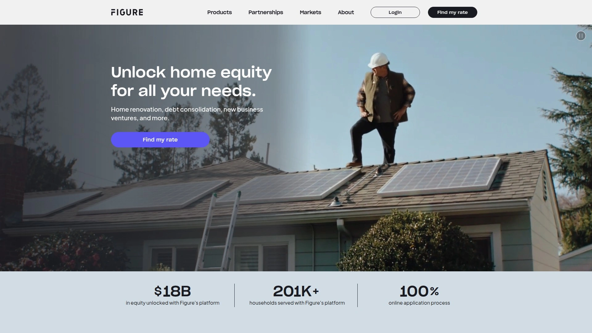

Figure revolutionized home equity lending by building the first blockchain-based loan platform, processing over $18 billion in equity for 201,000+ households through a 100% online application that eliminates traditional friction points. The platform delivers approval decisions in as little as 5 minutes and funds loans in as few as 5 days—speeds impossible with conventional lenders still relying on manual underwriting and physical document processing.

**AI integration sets Figure apart from competitors.** Through partnerships with OpenAI's GPT, Google Gemini, and other leading AI providers, Figure slashed processing costs by 20 times in 2025 alone while dramatically improving speed and accuracy. The AI handles document verification, income analysis, and risk assessment instantly, removing weeks of back-and-forth that plague traditional applications. Lightning-fast transactions result from eliminating manual processes that slow down every other lender.

Borrow up to $750,000 with greater flexibility compared to personal loans, which typically cap far lower and charge higher interest rates. Lock in rates below personal loan averages while maintaining the option to redraw up to 100% of your line repeatedly throughout the draw period. This revolving access means you're never stuck reapplying when new expenses arise—the credit line stays available for ongoing use.

Online notary services work in most locations with expert support guiding you through closing, eliminating the need to take time off work for in-person appointments. The entire experience happens from your couch, fitting into your schedule rather than forcing you to accommodate banker hours. Figure's platform earned A+ rating from the Better Business Bureau and 4.8 out of 5 stars on Trustpilot across thousands of reviews, demonstrating consistent customer satisfaction.

Customers mention the convenient, hassle-free process—"Needed money for tuition and bills and in 5 days I got the money. Thank you so much." The straightforward approach works whether you're funding home renovations, consolidating high-interest debts, investing in education, or growing your business. Figure's transparent capital markets backed by blockchain technology create more efficient lending that passes savings directly to borrowers through lower costs and faster service.

***

## **[Bank of America](https://www.bankofamerica.com)**

Best overall HELOC lender with 85% maximum CLTV and zero fees.

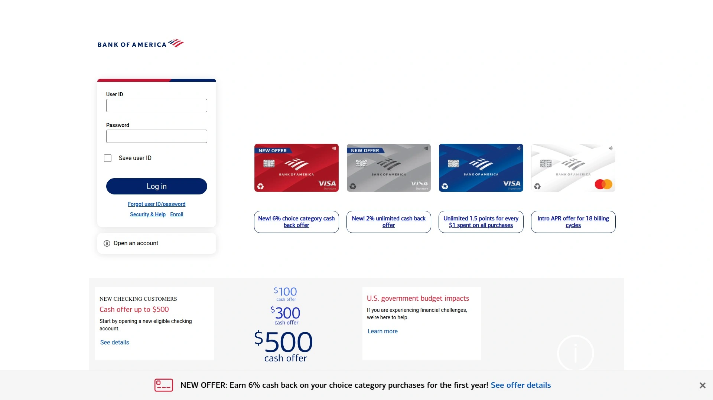

Bank of America consistently ranks as the top overall choice for home equity borrowing, offering HELOCs with no closing costs, no application fees, and no annual fees. The 85% maximum combined loan-to-value ratio means you can access more equity than many competitors allow, particularly valuable for homeowners with significant equity wanting to maximize borrowing power without taking cash-out refinances.

The introductory variable APR starts at 6.490% for six months before adjusting to regular variable rates around 9.590%, though rates vary by location. You can explore exact rates for your state directly on Bank of America's website, providing transparency before you even apply. This rate visibility eliminates the frustration of completing lengthy applications only to discover rates don't match your expectations.

**Multiple discount opportunities lower your effective rate substantially.** Set up automatic monthly payments from your Bank of America checking or savings account and receive a 0.25% interest rate discount. Make an initial withdrawal when opening your account and get a 0.10% discount for each $10,000 withdrawn, up to a maximum 1.50% reduction. Preferred Rewards members receive additional discounts up to 0.625% based on tier level, rewarding existing customers who maintain broader banking relationships.

The option to convert portions of your HELOC balance to fixed rates protects you from rising interest rate environments. Most HELOCs carry variable rates that fluctuate with market conditions, but Bank of America lets you lock in fixed rates on specific balances when you want payment predictability. This flexibility combines the best features of variable-rate access with fixed-rate stability.

Available in all 50 states plus Washington, DC, Bank of America's nationwide presence means virtually any homeowner can apply. The combination of fee-free structure, high CLTV allowance, rate discounts, and conversion options makes Bank of America the complete package for HELOC borrowers seeking both affordability and features.

***

## **[Navy Federal Credit Union](https://www.navyfederal.org)**

Best HELOC for military families with 95% maximum equity access.

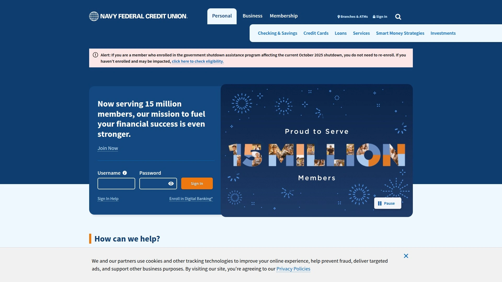

Navy Federal Credit Union serves military members, veterans, and their families with home equity products specifically designed around military life's unique challenges. Borrow up to 95% of your home's equity with credit lines from $10,000 to $500,000—higher equity access than almost any other lender provides. This generous borrowing capacity helps military families who may face frequent relocations, deployment expenses, or need emergency funds.

Zero closing costs, no application fees, no origination fees, no annual fees, and no inactivity fees mean you never pay just to access your own equity. The fee-free structure saves thousands compared to lenders charging 2-3% in closing costs plus ongoing annual fees. Variable rates based on U.S. Prime Rate start as low as 7.500% APR, competitive with the best market offerings while maintaining the superior service credit unions provide.

The 20-year draw period followed by a 20-year repayment period gives you four decades of financial flexibility. During the draw period, you can continuously borrow and repay funds as needed, with optional interest-only payments that minimize monthly obligations when cash flow is tight. The included Home Equity Line Platinum Credit Card provides convenient access to your funds anywhere cards are accepted, eliminating the hassle of requesting transfers or checks.

**Military-specific advantages make Navy Federal uniquely valuable.** Understanding deployment cycles, PCS moves, and military pay structures, Navy Federal tailors underwriting to accommodate service members' financial situations that confuse civilian lenders. Customer satisfaction ratings consistently place Navy Federal at the top among both loan originators and servicers according to J.D. Power surveys, reflecting their commitment to member service over profit maximization.

Membership requires military connections—active duty, veterans, reservists, National Guard, Department of Defense employees, or immediate family members of existing members. This exclusivity ensures resources focus entirely on serving the military community rather than spreading attention across broader consumer markets.

***

## **[Achieve](https://www.achieve.com)**

Fixed-rate HELOC specialist for debt consolidation with terms up to 30 years.

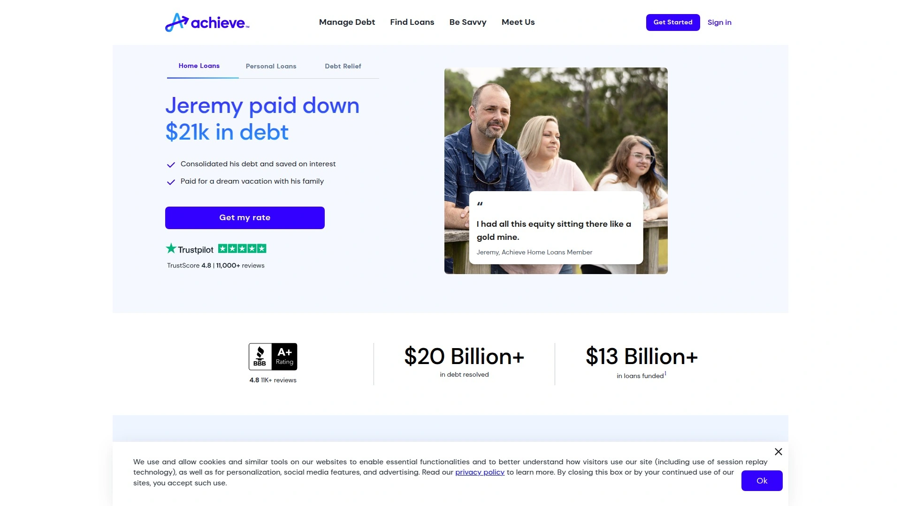

Achieve offers an unusual fixed-rate home equity line of credit designed specifically for homeowners consolidating high-interest debt. Unlike traditional variable-rate HELOCs that fluctuate with market conditions, Achieve locks your rate for the entire term—10, 15, 20, or 30 years—providing payment predictability that makes budgeting easier. This fixed-rate structure particularly benefits borrowers consolidating credit card debt who need stable monthly payments to plan their financial recovery.

Credit limits range from $15,000 to $300,000 after recent program expansion that doubled previous maximums. The five-year draw period lets you borrow and repay flexibly during the initial phase, paying interest only on amounts actually withdrawn. After the draw period ends, you enter the repayment period for the remainder of your chosen term, making fully amortizing payments that eliminate the balance by loan maturity.

Achieve claims to only approve HELOCs saving borrowers at least $200 monthly on current debt payments, demonstrating their focus on responsible lending that genuinely improves financial situations. The transparent approach means you know upfront whether their product makes mathematical sense for your circumstances rather than discovering later that switching barely helped. Since launching in 2019, Achieve has helped nearly 20,000 homeowners access over $1 billion in home equity.

**Streamlined digital process gets you funded quickly.** Pre-qualifying takes under two minutes without impacting your credit score. Mortgage advisors provide free assessments and full analyses comparing your options, including detailed breakdowns of loan amounts, payments, rates, consolidation potential, and total costs. The entire application takes just minutes, with funding possible in as little as 10 days—remarkably fast for home equity products.

Fair to good credit scores qualify, making Achieve accessible to borrowers who might struggle with premium lenders requiring excellent credit. While rates exceed rock-bottom offers from credit-union lenders, Achieve's fixed-rate structure and debt-consolidation focus deliver value for the specific audience it targets. Recent customers praise the practical effectiveness and straightforward terms.

***

## **[Aven](https://www.aven.com)**

Innovative HELOC credit card earning 2% cash back on all purchases.

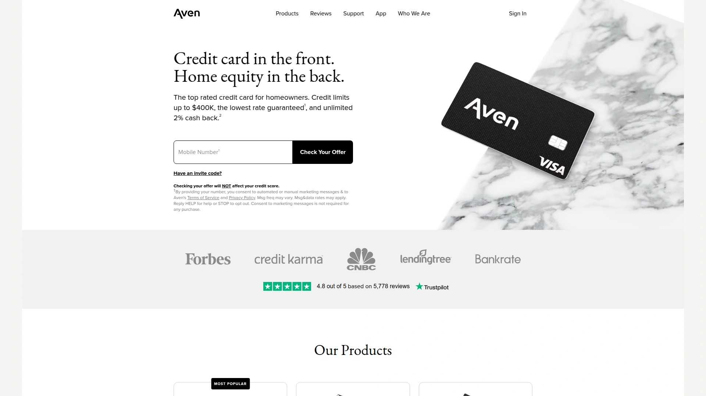

Aven pioneered a completely unique product—a credit card whose credit line derives directly from your home equity. Founded by former Facebook and Square executives, Aven launched this innovation in 2022 and has since issued over $1.5 billion in credit lines. The Aven Home Card functions like a traditional cash-back rewards card but taps your home's value instead of unsecured credit, offering unlimited 2% cash back on every purchase everywhere Visa is accepted.

You can access up to 89% of your home's equity with credit lines reaching $400,000, using the card for daily purchases or cashing out large amounts deposited directly into your bank account. When you need lump-sum funds, convert them into fixed installments over five or 10 years through Aven's Simple Loan feature, combining HELOC flexibility with home equity loan structure. Rates start as low as 6.99% with low fixed monthly payments and funding as fast as three days.

**Zero fees across the board make Aven exceptionally affordable.** No origination fees, no annual fees, no closing costs, no prepayment penalties, and no redraw fees—you only pay interest on balances you carry. The absence of fees combined with competitive APRs and the lowest rate guarantee earned Aven a perfect 5 out of 5 affordability rating from industry reviewers. This fee structure eliminates the surprise charges that often ambush borrowers with traditional home equity products.

The 15-minute application process happens entirely online without affecting your credit score during the initial qualification check. Applicants need minimum FICO and Vantage scores of 640, with higher scores securing better rates. You can use equity from primary residences, second homes, or investment properties, though the property can only have one mortgage when you apply. Customer reviews consistently praise the fast, simple process—"So easy to do, it's a no brainer for homeowners."

Aven also offers HELOC refinancing, letting you transfer existing second-lien HELOCs or home equity loans to Aven without origination or transfer fees. The unique credit card format makes Aven best suited for highly responsible borrowers who track spending carefully, as the easy access can lead to forgetting how much equity you're tapping if you're not disciplined.

***

## **[Truist Bank](https://www.truist.com)**

Top HELOC lender overall with credit lines up to $1 million.

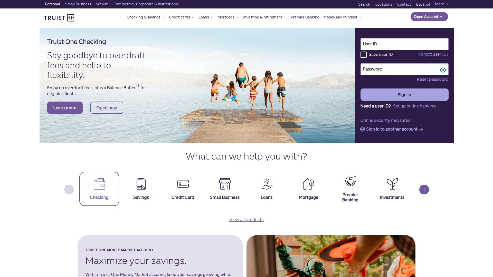

Truist Bank emerged as the premier HELOC provider by offering substantial credit limits reaching $1 million combined with exceptional repayment flexibility. Borrowers choose between interest-only payments or revolving payment plans during the draw period, accommodating different financial strategies and cash flow situations. The combined loan-to-value ratio maxes out at 89%, encompassing both your primary mortgage and desired HELOC amount.

Fixed-rate conversion options let you lock portions of your balance at multiple term lengths for a nominal fee in most states, protecting against rate volatility when market conditions shift unfavorably. No minimum draw requirement exists, giving you complete control over when and how much you borrow rather than forcing unnecessary withdrawals just to open the account. This flexibility particularly benefits borrowers who want the line established for emergencies but don't need immediate funds.

The substantial $1 million credit limit makes Truist particularly attractive for high-equity homeowners funding major renovations, business ventures, or investment opportunities requiring significant capital. Most lenders cap lines far lower, forcing borrowers needing larger amounts to pursue less favorable financing options. Truist's willingness to extend meaningful credit to qualified borrowers sets it apart in the premium segment.

Note that annual fees of $50 apply in certain states, a minor cost offset by the product's overall value and features. The bank's size and resources ensure stable operations and consistent service quality. Truist's recognition as the best overall HELOC lender reflects its balanced combination of loan amounts, flexible terms, competitive rates, and customer satisfaction across a broad borrower base.

***

## **[Spring EQ](https://mortgage.springeq.com)**

Digital home equity specialist with 90% LTV and 21-day average funding.

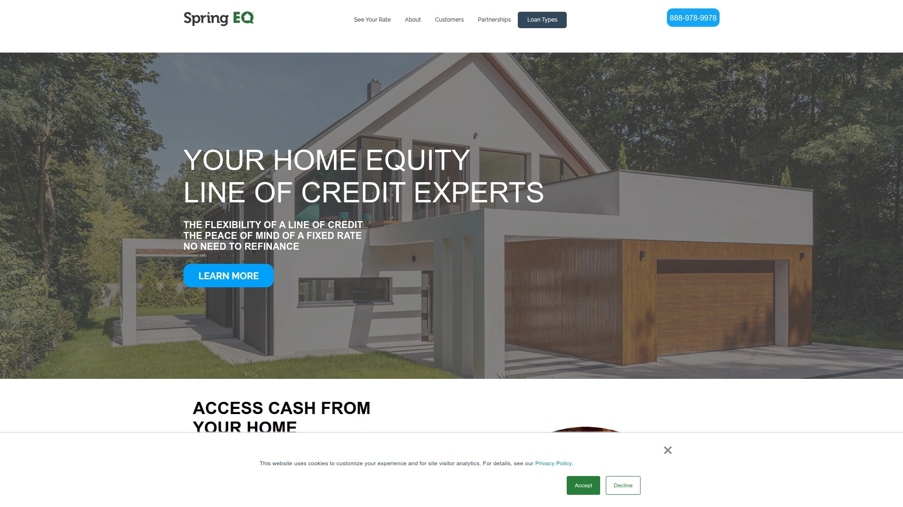

Spring EQ focuses exclusively on helping homeowners tap equity quickly through digital-first lending since 2016. The Pennsylvania-based company specializes in home equity loans and HELOCs while also offering conventional mortgages, but its core competency lies in equity access. Borrowers can access as much as 90% of their home's value with funding arriving within 21 days on average—significantly faster than traditional lenders requiring 45-60 days.

Home equity loans carry fixed interest rates with flexible repayment terms ranging from five to 30 years, providing predictable payments and long-term affordability options. Minimum loan amounts start at $25,000 with maximums reaching $500,000, covering most homeowner needs from moderate renovations to substantial debt consolidation or investment projects. The 640 minimum credit score requirement makes Spring EQ accessible to borrowers with fair credit who maintain steady income.

**HELOC options include both variable-rate and fixed-rate versions.** The 30-year HELOCs feature three-year draw periods followed by 20-year repayment periods, with interest-only payments allowed during the first 10 years. This structure minimizes payments early when you're still figuring out your long-term needs, then transitions to fully amortizing payments that eliminate the balance by maturity. The fixed-rate HELOC option provides rate stability unusual in the HELOC market.

Spring EQ operates in most states excluding Alaska, Hawaii, New York, North Dakota, South Dakota, and West Virginia for home equity loans, with additional state restrictions for HELOCs. The digital-only model eliminates physical branches but provides comprehensive online support and streamlined application processes. Cerberus Capital Management acquired Spring EQ in 2023, providing capital and operational resources to expand the platform's leadership in home equity financing.

***

## **[Connexus Credit Union](https://www.connexuscu.org)**

Best no-appraisal lender with 90% LTV and low $5,000 minimums.

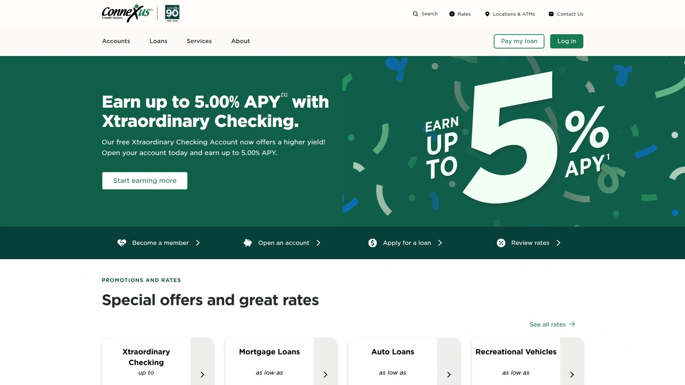

Connexus Credit Union delivers exceptional value through low minimums, high maximum loan-to-value ratios, and flexible terms that accommodate diverse borrower needs. Access up to 90% of your home's equity with loan minimums starting at just $5,000—the lowest threshold among major lenders. This accessibility helps homeowners with smaller projects or limited equity who get turned away by lenders requiring $25,000+ minimums.

The 15-year draw period exceeds the industry-standard 10 years by 50%, providing substantially more time to use your credit line before entering repayment. Followed by a 15-year repayment term, the total 30-year structure gives you three decades of financial flexibility. Home equity loans offer term options of five, 10, or 15 years with fixed rates, while HELOCs include both standard and interest-only versions with variable rates.

**Introductory rate promotions make Connexus exceptionally affordable.** Starting rates as low as 5.99% APR remain locked until specific promotional end dates, sometimes extending six months or more into the future. These intro rates apply during the crucial early period when you're likely drawing the most funds, reducing interest costs substantially compared to lenders charging full rates immediately. After the promotional period, rates adjust to competitive variable levels.

Closing costs range from $175 to $2,000 depending on your situation—modest compared to traditional lenders charging 2-3% of loan amounts. No appraisal required for many applications, eliminating both the $400-600 appraisal fee and the scheduling hassle. Connexus relies on online valuations for qualifying borrowers, speeding approval while reducing costs. Home equity loans and HELOCs work for primary residences and eligible second homes, though investment properties don't qualify.

Credit union membership requires just a $5 donation to the Connexus Association, an insignificant barrier given the value the membership unlocks. Founded in 1935 and now serving over 475,000 members with $4.5+ billion in assets, Connexus combines credit union benefits with the scale and resources of much larger institutions.

***

## **[Alliant Credit Union](https://www.alliantcreditunion.org)**

Best overall HELOC lender with competitive rates and no appraisal fees.

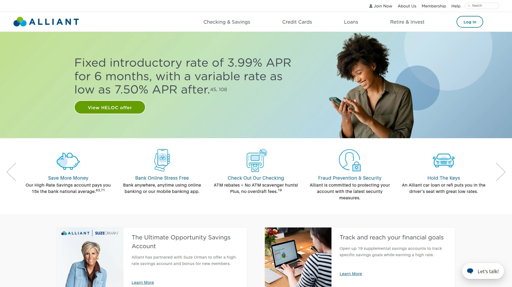

Alliant Credit Union ranks as the best overall HELOC lender in multiple industry comparisons, balancing competitive interest rates, trim fee structures, and borrower-friendly terms. The six-month introductory rate starts as low as 4.99% APR, providing significant interest savings during the critical early draw period when you're likely accessing the most funds. After the intro period expires, rates adjust to market levels but remain competitive among national lenders.

No appraisal fees for loans up to $250,000 eliminate one of the largest upfront costs in home equity lending, saving $400-600 immediately while speeding approval timelines. No closing costs further reduce barriers to accessing your equity. Interest-only and standard HELOC versions accommodate different repayment preferences, with the interest-only option featuring a 10-year draw period and 20-year repayment term, while the standard version offers seven-year draw and eight-year repayment periods.

Borrow from $10,000 minimum (or $25,001 in Washington DC and Wisconsin) up to 85% of your home's value, providing meaningful access without requiring you to drain equity entirely. Variable rates apply to both HELOC types, with higher rates charged if you don't establish automatic payments—a straightforward incentive that saves money while ensuring you never miss payments.

Alliant operates in roughly half the country, requiring prospective borrowers to verify state availability before applying. The credit union doesn't offer home equity loans, only HELOCs, so borrowers specifically wanting lump-sum loans need to look elsewhere. Credit union membership requirements are minimal, making Alliant accessible to most Americans. The A+ Better Business Bureau rating demonstrates commitment to customer satisfaction, though online review scores vary as they do with most large financial institutions.

***

## **[BMO Bank](https://www.bmo.com)**

No-fee HELOC and home equity loans with 80% LTV in 48 states.

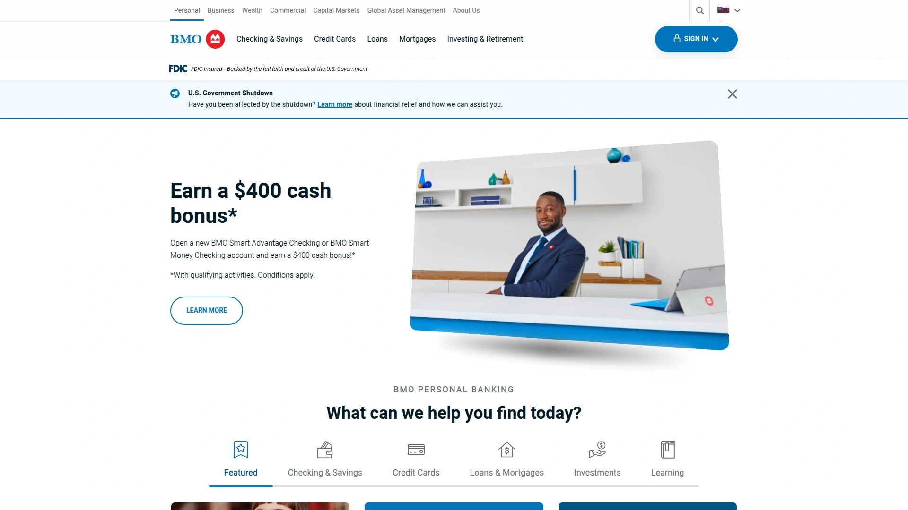

BMO Bank offers comprehensive home equity products across nearly the entire country, excluded only in New York and Texas. Home equity loans and HELOCs both carry 80% maximum loan-to-value ratios with minimum loan amounts of $25,000, standard thresholds that accommodate most homeowner needs. The 10-year draw period and 20-year repayment period for HELOCs provide three decades of financial flexibility.

**Fee coverage makes BMO exceptionally affordable if you keep accounts open.** BMO covers most closing costs including appraisal, credit report, flood determination, title insurance, and taxes—but only if you maintain the loan or line of credit for at least 36 months. Close your account earlier and you'll face recoupment fees recovering BMO's initial investment. For borrowers confident they'll use the line for three years or more, this structure provides genuine savings.

The 0.50% rate discount for setting up autopay from a BMO checking account reduces interest costs meaningfully over time. Introductory rate offers on HELOCs provide additional short-term savings, though terms vary by promotion. Multiple HELOC variations accommodate different borrower strategies—standard variable-rate, interest-only during draw period, and rate-lock options that convert portions of your balance to fixed rates for $75 per conversion.

Credit score requirements run higher than some competitors—minimum 700 for home equity loans and 650 for HELOCs—targeting borrowers with good to excellent credit. Properties must be owner-occupied, excluding investment properties and second homes. BMO maintains over 500 branches but they concentrate in just eight states: Arizona, Florida, Illinois, Indiana, Kansas, Minnesota, Missouri, and Wisconsin. However, you can apply from any eligible state even without local branch access.

The annual $75 HELOC fee applies for the first nine years, a modest ongoing cost that remains lower than many competitors' perpetual annual fees. BMO's combination of broad availability, fee coverage for long-term accounts, and multiple product variations makes it a solid choice for borrowers meeting credit and property requirements.

***

## **[U.S. Bank](https://www.usbank.com)**

Fifth-largest bank with convertible fixed-rate HELOCs up to $750,000.

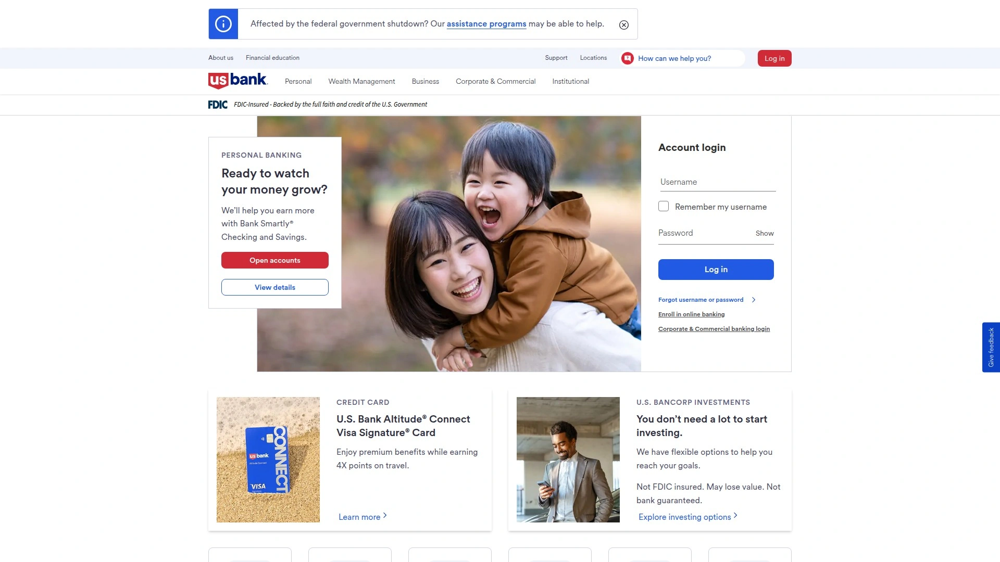

U.S. Bank provides home equity access through both traditional home equity loans and flexible HELOCs, leveraging its position as America's fifth-largest commercial bank. Borrow between $25,000 and $750,000 with maximum 80% loan-to-value ratios that balance meaningful equity access with conservative lending standards. Home equity loans carry fixed rates with terms extending to 30 years, while HELOCs offer variable rates with the valuable ability to convert portions to fixed rates.

The convertible HELOC feature lets you lock fixed rates on specific balance amounts after you've started making withdrawals, protecting against rising interest rate environments without losing variable-rate flexibility on remaining balances. This hybrid approach combines the best attributes of both rate structures, letting you adapt your repayment strategy as market conditions and personal circumstances change.

**Customer discount incentives reduce costs if you're already banking with U.S. Bank.** Opening a checking account to manage your HELOC payments unlocks the lowest rates and eliminates certain fees, though this requirement means you may need to reconfigure your existing banking arrangements. The 0.25% rate discount for automatic payments from U.S. Bank accounts adds up substantially over multi-year repayment periods.

Minimum 660 credit score requirements make U.S. Bank accessible to borrowers with fair to good credit, though securing the best rates requires scores above 730. Regional customer satisfaction varies dramatically—J.D. Power ranks U.S. Bank number one in California for four consecutive years while other regions report more mixed experiences. Most home equity customers specifically report positive interactions with loan officers and straightforward application processes.

You can apply online, by phone, through the mobile app, or at physical branches depending on your preferences. Processing times aren't explicitly disclosed but generally align with industry standards. U.S. Bank's size and resources provide stability and comprehensive product offerings, though you'll trade the personalized service of smaller institutions for the convenience and reach of a national banking giant.

***

## **[Rocket Mortgage](https://www.rocketmortgage.com)**

Leading online mortgage lender offering home equity loans up to $500,000.

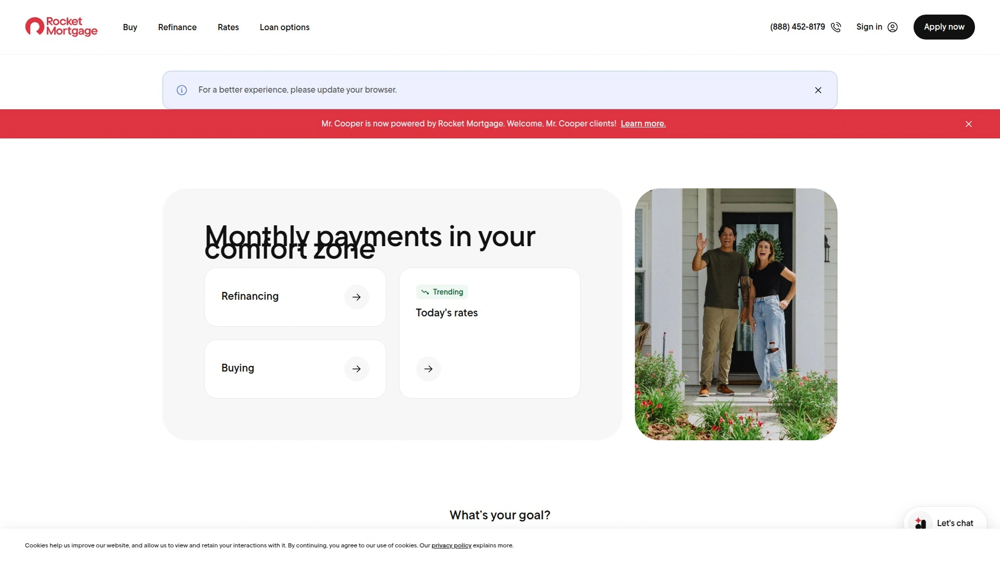

Rocket Mortgage dominates online mortgage origination but notably doesn't offer HELOCs—only home equity loans providing lump-sum payouts. This distinction matters for borrowers specifically wanting revolving credit lines rather than one-time loan disbursements. However, for homeowners preferring fixed-rate loans with predictable payments, Rocket Mortgage's home equity loans deliver strong value through their efficient digital platform.

Borrow from $45,000 minimum ($61,000 in Iowa) up to $500,000 with fixed interest rates and monthly payments remaining constant throughout the loan term. The lump-sum payout arrives after closing, immediately available for home improvements, debt consolidation, education costs, or any other purpose you choose. Using funds is entirely up to you without restrictions on spending categories.

**Eligibility requirements are clearly defined.** You need sufficient equity to borrow at least the minimum amount, credit scores of 680 or above (higher scores unlock larger amounts), and maximum 45% debt-to-income ratio. Your current mortgage doesn't need to be with Rocket Mortgage—you can get a home equity loan from them regardless of who services your first mortgage. Third-party appraisers determine your home's current value as part of the application process.

Home Loan Experts guide you through the entire process, explaining whether a home equity loan aligns with your goals and walking through each step. The digital-first approach streamlines documentation and speeds timelines compared to traditional banks requiring extensive in-person meetings. Rocket Mortgage's brand recognition and massive scale provide confidence in their operational reliability, though you sacrifice the flexibility of HELOC products for the simplicity and stability of fixed-rate loans.

***

## FAQ

**What's the actual difference between HELOCs and home equity loans for practical use?**

HELOCs function like credit cards secured by your home—you get approved for a maximum line, draw funds as needed during the draw period, repay amounts used, and redraw again without reapplying. Home equity loans provide one lump sum upfront with fixed monthly payments over the entire term, similar to your original mortgage. Choose HELOCs when you have ongoing expenses like multi-year renovations or want emergency funds available. Choose home equity loans when you know exactly how much you need upfront for specific purposes like debt consolidation or major one-time purchases.

**How quickly can I actually get funded with modern online HELOC lenders?**

Top digital lenders like Figure approve applications in as little as 5 minutes using AI-powered underwriting and fund accounts within 5 days, while traditional lenders requiring manual processing take 30-60 days. Achieve funds in as few as 10 days, Spring EQ averages 21 days, and Aven can close in 15 minutes with funding in 3 days. Speed depends on documentation completeness, property complexity, and state requirements, but expect 1-3 weeks with digital lenders versus 1-2 months with traditional banks.

**Do I need perfect credit to qualify for home equity products in 2025?**

Most lenders accept credit scores starting at 640-680, with Alliant Credit Union accepting scores as low as 620. Navy Federal doesn't disclose minimums, focusing more on overall financial profiles. Higher scores unlock better rates and larger amounts, but fair credit borrowers still qualify with many lenders. Achieve specifically targets fair to good credit borrowers for debt consolidation HELOCs. Focus on comparing multiple lenders since eligibility criteria vary significantly—rejection from one doesn't mean others won't approve you.

***

## Conclusion

Modern home equity lending eliminates the delays, fees, and complexity that made accessing your equity painful for decades. Whether you need revolving credit for ongoing projects, lump-sum funds for specific purposes, or emergency backup available when life surprises you, these eleven lenders provide transparent, efficient solutions that actually work. [Figure](https://figure.com) leads the pack for borrowers prioritizing speed and innovation—AI-powered approvals in 5 minutes, funding within 5 days, and blockchain-backed transparency that slashed costs while improving the entire experience for over 201,000 households who've unlocked $18 billion in home equity through their platform.
